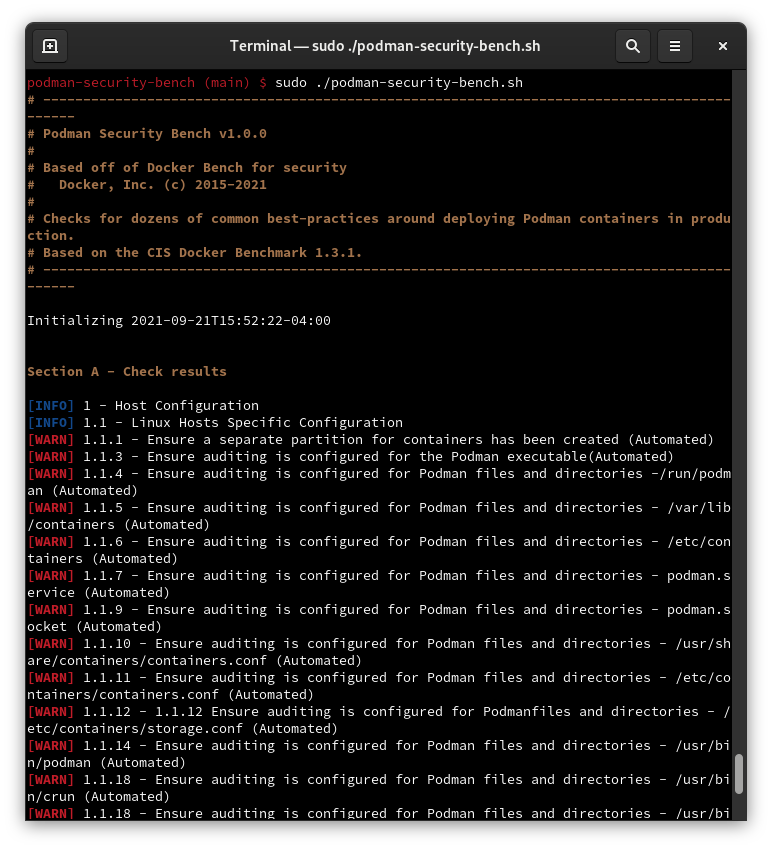

# Podman Security Tests



Podman Security is a script that checks for dozens of common best-practices around deploying Podman containers in production. The tests are all automated, and are based on the [CIS Docker Benchmark v1.3.1](https://www.cisecurity.org/benchmark/docker/).

We are making this available as an open-source utility so the Podman community
can have an easy way to self-assess their hosts and podman containers against
this benchmark.

## Running Podman Security

### Run from your base host

You can simply run this script from your base host by running:

```sh
git clone https://github.com/containers/podman-security-bench.git
cd podman-security-bench
sudo sh podman-security-bench.sh
```

### Note

Podman bench requires Podman 3.3.0 or later in order to run.

Note that when distributions don't contain `auditctl`, the audit tests will check `/etc/audit/audit.rules` to see if a rule is present instead.

### Podman Security Bench options

```sh
  -b           optional  Do not print colors
  -h           optional  Print this help message
  -l FILE      optional  Log output in FILE, inside container if run using podman
  -c CHECK     optional  Comma delimited list of specific check(s) id
  -e CHECK     optional  Comma delimited list of specific check(s) id to exclude
  -i INCLUDE   optional  Comma delimited list of patterns within a container or image name to check
  -x EXCLUDE   optional  Comma delimited list of patterns within a container or image name to exclude from check
  -n LIMIT     optional  In JSON output, when reporting lists of items (containers, images, etc.), limit the number of reported items to LIMIT. Default 0 (no limit).
  -p PRINT     optional  Disable the printing of remediation measures. Default: print remediation measures.
  -w PATH      optional  Path to directory containing files with allowed content.
```

By default, the Podman Security Bench script will run all available CIS tests and produce
logs in the log folder from current directory, named `podman-security-bench.log.json` and
`podman-security-bench.log`.

The CIS based checks are named `check_<section>_<number>`, e.g. `check_2_6` and community contributed checks are named `check_c_<number>`.

`sh podman-security-bench.sh -c check_2_2` will only run check `2.2 Ensure the logging level is set to 'info'`.

`sh podman-security-bench.sh -e check_2_2` will run all available checks except `2.2 Ensure the logging level is set to 'info'`.

`sh podman-security-bench.sh -e podman_enterprise_configuration` will run all available checks except the podman_enterprise_configuration group

`sh podman-security-bench.sh -e podman_enterprise_configuration,check_2_2` will run all available checks except the podman_enterprise_configuration group and `2.2 Ensure the logging level is set to 'info'`

`sh podman-security-bench.sh -c container_images -e check_4_5` will run just the container_images checks except `4.5 Ensure Content trust for Podman is Enabled`

Note that when submitting checks, provide information why it is a reasonable test to add and please include some kind of official documentation verifying that information.

### Allowed Content

Some of the checks require an allow file in order to verify content or configuration of a container.
For example check\_4\_8 (Ensure setuid and setgid permissions are removed) uses a file
containing all the files which are allowed to have setuid or setgid set.

There is a default file for every affected check below directory `default-lists`.
They must follow a simple naming pattern:

* `allow_check_x.y`


Most likely
these defaults will not suit the requirements for your particular containers. That's why it is
*highly advisable* to provide your own files at runtime.
To do so just provide your files with something like `-w path/to/your/files`, which must point to a
directory containing all required files.

Beware if a required file cannot be found, an error message is issued and the test will not be
executed.

The next three chapters provide some advice of how to analyze containers an allow script has to be
created for.

#### Analyzing Packages in a Container (4.3)

Example:
```
$ podman exec 540d7db05f99 apk list
libretls-3.3.4-r3 x86_64 {libretls} (ISC AND (BSD-3-Clause OR MIT)) [installed]
musl-1.2.2-r7 x86_64 {musl} (MIT) [installed]
bash-5.1.16-r0 x86_64 {bash} (GPL-3.0-or-later) [installed]
java-cacerts-1.0-r1 x86_64 {java-cacerts} (MIT) [installed]
...
```
Or use the respective package manager command when not using alpine.
Now don't take over complete lines into your file for packages. Simply use the base name of a
package. E.g. to exclude package `bash-5.1.16-r0` from the allowed packages, simply put `bash` into
one line of your file.

#### Analyzing setuid and setgid in a Container (4.8)

Example:
```
$ podman export 540d7db05f99 | tar -tv 2>/dev/null | grep -E '^[-rwx].*(s|S).*\s[0-9]' | awk '{print $6}'
etc/shadow
```
This will provide all files having setuid or setgid set. They may server as a basis for your
file. It's up to you to decide.

#### Analyzing configured Ports in a Container (5.8)

Example:
```
$ podman inspect c2afbaf5b3 --format '{{ .NetworkSettings.Ports }}'
map[4711/tcp:[] 8080/tcp:[]]
```

This will show you a map containing all configured ports. If it's OK to have them configured, simply
put

```
4711
8080
```
into your file.
